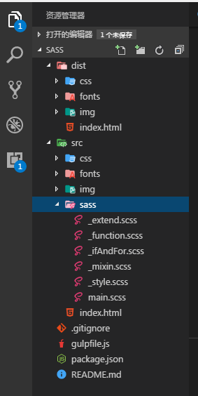
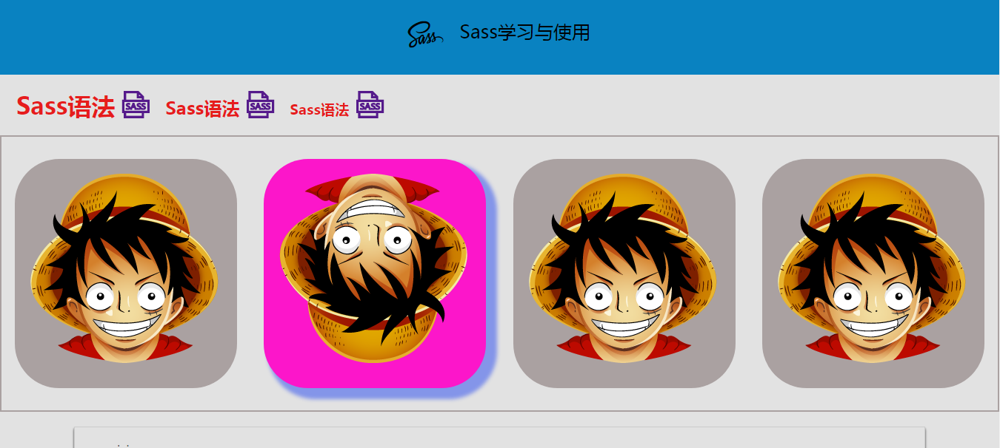

# sass
&emsp;&emsp;通过学习Sass知识，编写一个使用Sass的静态页。本demo使用gulp-webserver创建一个静态服务器，gulp-livereload实现网页自动刷新，使用gulp-sass把sass文件转化为CSS。

clone远程仓库到本地：
>git clone https://github.com/San-Shui/sass.git

进入gulp目录
>cd sass

安装依赖
> yarn install 或者 npm install 

运行项目

>gulp

运行之后会生成一个dist目录，dist目录下的文件是通过配置gulp自动生成。

修改src目录下的任何文件都会自动刷新网页

